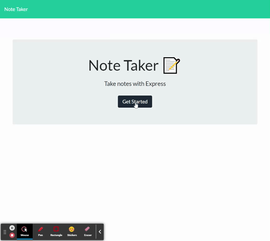

# Note Taker

* This application allows you to take notes and save them through your web browser. It is built using html, css, and javascript as well as Node.Js, Heroku, and Express.Js. The note data is retrieved from a JSON file and is hosted using Heroku. For users that need to keep track of alot of information, and edit that information, this application is perfect for you.

## Built With

* [HTML](https://developer.mozilla.org/en-US/docs/Web/HTML)
* [CSS](https://developer.mozilla.org/en-US/docs/Web/CSS)
* [Javascript](https://www.javascript.com/)
* [Node.Js](https://nodejs.org/en/)
* [Heroku](https://heroku.com/)
* [Express.Js](https://expressjs.com/)

## Deployed Link

* [Note Taker App](https://ucb-note-taker-2021.herokuapp.com/)

## Authors

* **DEREK BANISTER** 

- [Link to Portfolio Site](https://derekbanister.github.io/First-Portfolio/)
- [Link to Github](https://github.com/DerekBanister)
- [Link to LinkedIn](https://www.linkedin.com/in/derek-banister/)